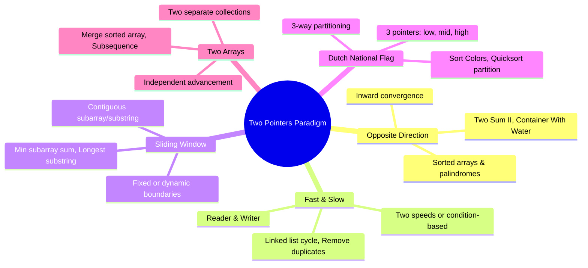
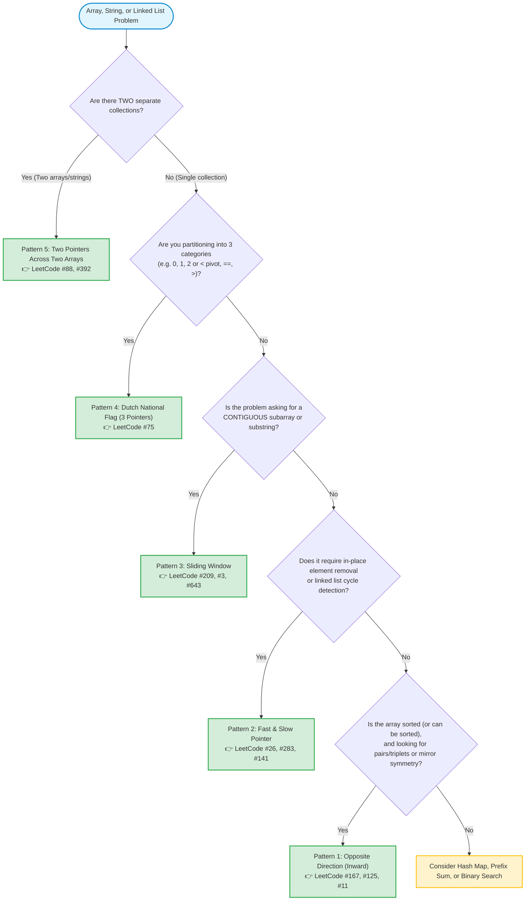

# Two Pointers Technique: Master Guide & Visual Cheat Sheet

> **Paradigm:** Multi-Index Traversal & Memory Partitioning  
> **Key Improvement:** Transforms brute-force $O(N^2)$ or $O(N^3)$ nested loops into blazing-fast $O(N)$ single-pass solutions.  
> **Memory Profile:** $O(1)$ Auxiliary Space (in-place execution).  

---

## 1. Introduction: What is the Two Pointers Technique? 💡

The **Two Pointers Technique** is an algorithmic strategy where two or more index pointers traverse one or more collections (arrays, strings, or linked lists) cooperatively. 

Instead of freezing one pointer and running an exhaustive nested loop through the entire rest of the array (which causes the classic $O(N^2)$ quadratic explosion), we move pointers **intelligently** based on mathematical properties (such as sorted order, window invariant checks, or partition boundaries).

### Real-World Analogy (Explain Like I'm 5 👶)
> Imagine two friends, **Alex** and **Sam**, holding opposite ends of a long rope or searching for a matching pair in a book from both sides.
> - Instead of Alex checking page 1 with all 500 pages, page 2 with all 500 pages...
> - Alex starts at page 1 (front) and Sam starts at page 500 (back).
> - They communicate after each check: if their combined clue is too small, Alex flips forward. If too large, Sam flips backward.
> - They meet in the middle in minutes rather than hours!

---

## 2. Why Does It Matter? (The Efficiency Leap) 🚀

| Approach | Time Complexity | For $N = 10,000$ Elements | For $N = 100,000$ Elements |
| :--- | :--- | :--- | :--- |
| **Brute Force (Nested Loops)** | $O(N^2)$ | ~100,000,000 operations | ~10,000,000,000 operations (Time Limit Exceeded 💥) |
| **Two Pointers** | $O(N)$ | ~10,000 operations | ~100,000 operations (Instant execution ⚡) |

---

## 3. The 5 Core Sub-Patterns at a Glance 🔍

### Sub-Pattern Comparison Matrix

| Sub-Pattern | Pointers | Movement Direction | Typical Condition / Trigger | Top LeetCode Examples |
| :--- | :--- | :--- | :--- | :--- |
| **1. Opposite Direction** | `L = 0`, `R = n - 1` | Inward toward each other (`L++`, `R--`) | Array is **sorted**; pair/triplet sum, palindrome symmetry. | [#167 Two Sum II](https://leetcode.com/problems/two-sum-ii-input-array-is-sorted/), [#125 Valid Palindrome](https://leetcode.com/problems/valid-palindrome/), [#11 Container With Water](https://leetcode.com/problems/container-with-most-water/) |
| **2. Fast & Slow** | `Slow = 0`, `Fast = 0` (or `1`) | Same direction at different speeds / triggers | In-place removal / rewrite; detecting cycles in linked lists. | [#26 Remove Duplicates](https://leetcode.com/problems/remove-duplicates-from-sorted-array/), [#283 Move Zeroes](https://leetcode.com/problems/move-zeroes/), [#141 Linked List Cycle](https://leetcode.com/problems/linked-list-cycle/) |
| **3. Sliding Window** | `L = 0`, `R = 0` | Same direction; `R` expands, `L` shrinks | Contiguous subarray/substring; maintain running metric. | [#209 Min Size Subarray Sum](https://leetcode.com/problems/minimum-size-subarray-sum/), [#3 Longest Substring Without Repeating](https://leetcode.com/problems/longest-substring-without-repeating-characters/) |
| **4. Dutch National Flag** | `low = 0`, `mid = 0`, `high = n - 1` | 3 pointers; `mid` scans, `low` and `high` bound | 3 distinct values / 3-way partitioning around a pivot. | [#75 Sort Colors](https://leetcode.com/problems/sort-colors/), [#905 Sort Array By Parity](https://leetcode.com/problems/sort-array-by-parity/) |
| **5. Two Arrays / Sequences** | `p1 = 0`, `p2 = 0` (or from back) | Move through 2 separate collections independently | Merging two sorted lists; subsequence character matching. | [#88 Merge Sorted Array](https://leetcode.com/problems/merge-sorted-array/), [#392 Is Subsequence](https://leetcode.com/problems/is-subsequence/) |

---

## 4. Visual Decision Flowchart: Which Sub-Pattern Do I Need? 🌲

---

## 5. Summary & Navigation 🧭

Explore each sub-pattern with complete visual traces, decision tables, edge cases, and idiomatic Swift implementations:

- 📖 **[2. Opposite Direction.md](file:///Users/akshatgandhi/Projects/Demo/MyLearnings/DSA%20Design%20Pattern/Two%20Pointers/2.%20Opposite%20Direction.md)** — Sorted pair sums, palindromes, container with most water.
- 📖 **[3. Fast & Slow Pointer.md](file:///Users/akshatgandhi/Projects/Demo/MyLearnings/DSA%20Design%20Pattern/Two%20Pointers/3.%20Fast%20&%20Slow%20Pointer.md)** — In-place array deduplication, move zeroes, Floyd's cycle detection.
- 📖 **[4. Sliding Window.md](file:///Users/akshatgandhi/Projects/Demo/MyLearnings/DSA%20Design%20Pattern/Two%20Pointers/4.%20Sliding%20Window.md)** — Fixed and dynamic subarray/substring optimization.
- 📖 **[5. Dutch National Flag.md](file:///Users/akshatgandhi/Projects/Demo/MyLearnings/DSA%20Design%20Pattern/Two%20Pointers/5.%20Dutch%20National%20Flag.md)** — 3-pointer partition for 3 distinct values (Sort Colors).
- 📖 **[6. Two Pointers Two Arrays.md](file:///Users/akshatgandhi/Projects/Demo/MyLearnings/DSA%20Design%20Pattern/Two%20Pointers/6.%20Two%20Pointers%20Two%20Arrays.md)** — Multi-sequence traversal and in-place backward merge.
- 📋 **[Master Pattern Template](file:///Users/akshatgandhi/Projects/Demo/MyLearnings/DSA%20Design%20Pattern/TEMPLATE.md)** — The blueprint for documenting any new algorithm.
