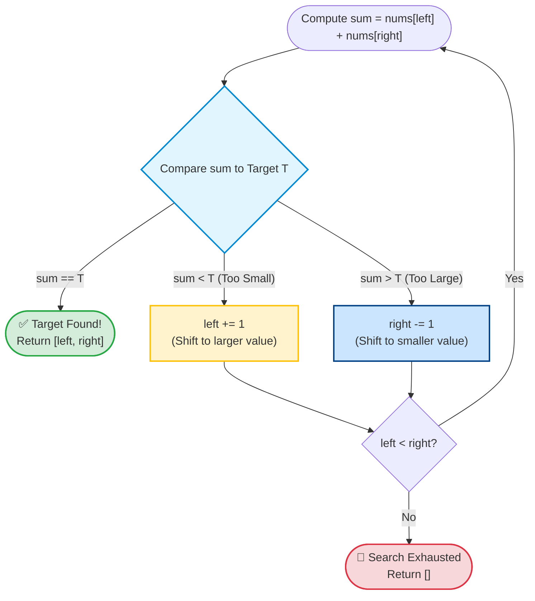

# Pattern 1: Opposite Direction Two Pointers (Inward Convergence)

> **Difficulty Level:** Beginner  
> **Primary Data Structures:** Arrays, Strings  
> **Time Complexity:** $O(N)$ (Single linear pass)  
> **Space Complexity:** $O(1)$ (In-place index tracking)  

---

## 1. Real-World Analogy (Explain Like I'm 5 👶)

> **The Numbered Street Analogy:**  
> Imagine you and your friend are walking toward each other on a street where house numbers are sorted from smallest (`1`) to largest (`100`).  
> You start at house `1` (Left end) and your friend starts at house `100` (Right end).  
> You both want to find two houses whose numbers add up to exactly `50`.  
> If your current sum is **too small**, you take a step forward toward bigger house numbers.  
> If the sum is **too big**, your friend takes a step backward toward smaller house numbers.  
> Because the street is sorted, you never need to turn around or re-check houses. You meet in the middle!

---

## 2. Core Concept & Visual Blueprint 🗺️

### What Is It?
Two pointers start at opposite ends of a **sorted** collection:
- `left` starts at index `0` (lowest value)
- `right` starts at index `n - 1` (highest value)

At each step, we evaluate the condition of `array[left]` and `array[right]`. Based on the evaluation, we either advance `left += 1`, decrement `right -= 1`, or terminate.

```text
Initial State:
 [ 1,   2,   4,   6,   9,  11 ]
   ▲                       ▲
   │                       │
 Left Pointer         Right Pointer
 (index 0)             (index 5)
   
       ──────▶   ◀──────
      Converge towards middle
```

---

## 3. When to Use Checklist 🎯

Ask yourself these questions when reading a problem:

- [ ] Is the array **sorted** (or can sorting it first at $O(N \log N)$ be acceptable)?
- [ ] Are you searching for a **pair or triplet** that equals a target sum?
- [ ] Does the problem require checking symmetry from both ends (e.g., **Palindromes**)?
- [ ] Does the problem involve **reversing an array or string in-place**?
- [ ] Are you computing a metric bounded by two walls (e.g., **Container With Most Water**)?

### Typical Problem Triggers:
- *"Given a 1-indexed array of integers numbers that is already sorted in non-decreasing order..."*
- *"Check if a string is a palindrome after removing non-alphanumeric characters..."*
- *"Find all unique triplets in the array which gives the sum of zero..."*

---

## 4. The Decision Rule Table & Flowchart 🧠



For a pair sum problem with target $T$:

| Current State | Evaluation | Action | Why? (Mathematical Intuition) |
| :--- | :--- | :--- | :--- |
| `nums[L] + nums[R] == T` | ✅ Match Found! | Return `[L, R]` | Both pointers together satisfy the target. |
| `nums[L] + nums[R] < T` | 🔻 Too Small | `left += 1` | The array is sorted. Moving `left` to the right increases the sum. |
| `nums[L] + nums[R] > T` | 🔺 Too Large | `right -= 1` | Moving `right` to the left decreases the sum. |
| `left >= right` | 🛑 Search Space Exhausted | Return `[]` | Pointers crossed without finding a match. |

---

## 5. Step-by-Step ASCII Walkthroughs 🚶‍♂️

### Walkthrough A: Finding Target Sum = 10
**Input:** `nums = [1, 2, 4, 6, 9, 11]`, `target = 10`

```text
Step 1:
 [ 1,  2,  4,  6,  9,  11 ]
   L                    R
 Sum: nums[0] + nums[5] = 1 + 11 = 12
 Evaluation: 12 > 10 (Too large)
 Action: Move Right pointer left (right = 4)

Step 2:
 [ 1,  2,  4,  6,  9,  11 ]
   L                R
 Sum: nums[0] + nums[4] = 1 + 9 = 10
 Evaluation: 10 == 10 (Exact match! 🎉)
 Action: Return indices [0, 4] (Values: 1, 9)
```

---

### Walkthrough B: Finding Target Sum = 13
**Input:** `nums = [1, 2, 4, 6, 9, 11]`, `target = 13`

```text
Step 1:
 [ 1,  2,  4,  6,  9,  11 ]
   L                    R
 Sum: nums[0] + nums[5] = 1 + 11 = 12
 Evaluation: 12 < 13 (Too small)
 Action: Move Left pointer right (left = 1)

Step 2:
 [ 1,  2,  4,  6,  9,  11 ]
       L                R
 Sum: nums[1] + nums[5] = 2 + 11 = 13
 Evaluation: 13 == 13 (Exact match! 🎉)
 Action: Return indices [1, 5] (Values: 2, 11)
```

---

## 6. Idiomatic Swift Code Implementations 💻

### Program 1: Two Sum II (Input Array Is Sorted) — LeetCode #167

```swift
func twoSumII(_ numbers: [Int], _ target: Int) -> [Int] {
    var left = 0
    var right = numbers.count - 1
    
    while left < right {
        let currentSum = numbers[left] + numbers[right]
        
        if currentSum == target {
            // LeetCode #167 expects 1-based indices
            return [left + 1, right + 1]
        } else if currentSum < target {
            left += 1 // Need a larger sum
        } else {
            right -= 1 // Need a smaller sum
        }
    }
    
    return [] // No pair found
}

// Verification
let sortedNumbers = [1, 2, 4, 6, 9, 11]
print(twoSumII(sortedNumbers, 10)) // Output: [1, 5] (1-based indices for 1 and 9)
```

---

### Program 2: Valid Palindrome — LeetCode #125

```swift
func isPalindrome(_ s: String) -> Bool {
    let chars = Array(s.lowercased())
    var left = 0
    var right = chars.count - 1
    
    while left < right {
        // Skip non-alphanumeric characters on the left
        if !chars[left].isLetter && !chars[left].isNumber {
            left += 1
            continue
        }
        
        // Skip non-alphanumeric characters on the right
        if !chars[right].isLetter && !chars[right].isNumber {
            right -= 1
            continue
        }
        
        // Compare characters
        if chars[left] != chars[right] {
            return false // Mismatch found
        }
        
        left += 1
        right -= 1
    }
    
    return true
}

// Verification
print(isPalindrome("A man, a plan, a canal: Panama")) // Output: true
print(isPalindrome("race a car"))                     // Output: false
```

---

### Program 3: Container With Most Water — LeetCode #11

```swift
func maxArea(_ height: [Int]) -> Int {
    var left = 0
    var right = height.count - 1
    var maxWater = 0
    
    while left < right {
        let width = right - left
        let currentHeight = min(height[left], height[right])
        let currentWater = width * currentHeight
        
        maxWater = max(maxWater, currentWater)
        
        // Greedy choice: Move the pointer with the shorter height
        if height[left] < height[right] {
            left += 1
        } else {
            right -= 1
        }
    }
    
    return maxWater
}

// Verification
print(maxArea([1, 8, 6, 2, 5, 4, 8, 3, 7])) // Output: 49
```

---

## 7. Complexity Analysis ⏱️

- **Time Complexity:** $O(N)$
  - The pointers start at distance $N - 1$. Each iteration of the `while` loop unconditionally decreases the distance between pointers by at least 1 (`left += 1` or `right -= 1`). The loop executes at most $N$ times.
- **Space Complexity:** $O(1)$
  - Only two integer index variables (`left`, `right`) and a few scalar accumulators are stored. No extra heap memory is allocated.

---

## 8. Common Traps & Edge Cases ⚠️

> [!CAUTION]
> 1. **The Array Must Be Sorted:**  
>    This technique **only** works for pair sum problems if the array is sorted. If the input is unsorted, either sort it first ($O(N \log N)$) or use a Hash Set/Dictionary ($O(N)$ time, $O(N)$ space).
>
> 2. **Strict Inequality (`left < right`):**  
>    Using `while left <= right` in pair-finding will cause `left == right`, allowing an element to pair with itself (e.g., in array `[5]`, target `10`, you might falsely return index `0` paired with index `0`). Use strict `<`.
>
> 3. **Handling Duplicate Pairs (e.g., 3Sum #15):**  
>    When finding all unique pairs/triplets, remember to skip identical adjacent elements (`while left < right && nums[left] == nums[left + 1] { left += 1 }`) to prevent duplicate outputs.

---

## 9. LeetCode Practice Matrix 🎯

| Difficulty | LeetCode # | Problem Name | Key Concept | Status |
| :--- | :--- | :--- | :--- | :---: |
| 🟢 Easy | [#125](https://leetcode.com/problems/valid-palindrome/) | Valid Palindrome | Inward convergence skipping symbols | [ ] |
| 🟢 Easy | [#344](https://leetcode.com/problems/reverse-string/) | Reverse String | In-place swapping at ends | [ ] |
| 🟢 Easy | [#977](https://leetcode.com/problems/squares-of-a-sorted-array/) | Squares of a Sorted Array | Compare absolute values from ends | [ ] |
| 🟡 Medium | [#167](https://leetcode.com/problems/two-sum-ii-input-array-is-sorted/) | Two Sum II | Sorted pair sum convergence | [ ] |
| 🟡 Medium | [#11](https://leetcode.com/problems/container-with-most-water/) | Container With Most Water | Bounded area calculation | [ ] |
| 🟡 Medium | [#15](https://leetcode.com/problems/3sum/) | 3Sum | Fixed pivot + 2 pointers with duplicate skipping | [ ] |
| 🟡 Medium | [#16](https://leetcode.com/problems/3sum-closest/) | 3Sum Closest | Track minimum delta to target | [ ] |
| 🔴 Hard | [#42](https://leetcode.com/problems/trapping-rain-water/) | Trapping Rain Water | LeftMax & RightMax boundary convergence | [ ] |

---

## 10. Connection to Our Swift Playgrounds 💡

In our [Arrays.playground](file:///Users/akshatgandhi/Projects/Demo/MyLearnings/Algorithms/Swift%20Collection/Arrays.playground), we explored how Swift arrays provide direct $O(1)$ random memory access via pointer offsets:
$$\text{Memory Address} = \text{Base Address} + (\text{Index} \times \text{Element Size})$$

Because Opposite Direction two-pointer navigation only increments and decrements raw integer indices, it executes in pure register arithmetic with no memory allocations or cache misses.
