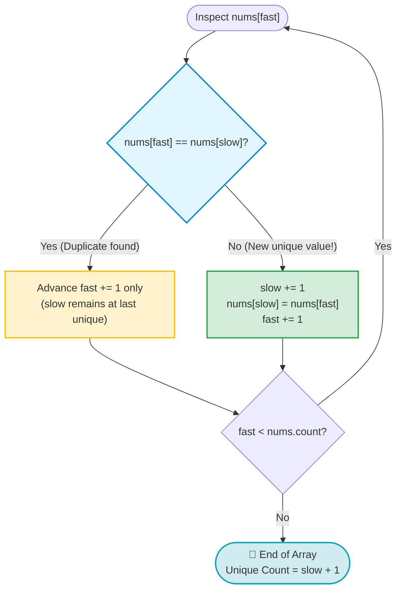
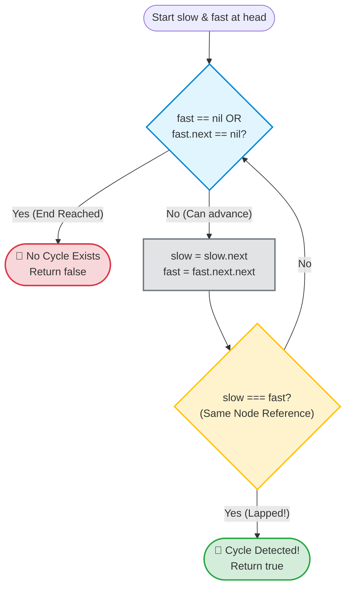

# Pattern 2: Fast & Slow Pointer (Reader-Writer & Tortoise-Hare)

> **Difficulty Level:** Beginner to Intermediate  
> **Primary Data Structures:** Arrays, Linked Lists, Strings  
> **Time Complexity:** $O(N)$ (Linear pass)  
> **Space Complexity:** $O(1)$ (In-place mutation or node reference tracking)  

---

## 1. Real-World Analogies (Explain Like I'm 5 👶)

This pattern has two famous real-world metaphors depending on whether you are working on an **Array** or a **Linked List**:

### Analogy A: The Inspector & The Scribe (Arrays: In-Place Editing)
> Imagine an inspector (**Fast**) walking quickly down a shelf of items, examining every item.
> Behind the inspector stands a scribe (**Slow**), whose job is to keep a neat row of accepted items.
> - The inspector (**Fast**) checks every item one by one.
> - Only when the inspector finds a *unique or valid* item does the scribe (**Slow**) take a step forward and neatly write it into the row.
> - Duplicates or unwanted items (like zeroes) are simply skipped!

### Analogy B: The Tortoise & The Hare (Linked Lists: Cycle Detection)
> Imagine a race track. If the track is a straight line, the fast Hare will reach the finish line and leave the slow Tortoise behind.
> But if the track has a **loop (cycle)**, the Hare will run in circles and eventually lap the Tortoise from behind!
> If the Hare ever catches up to the Tortoise, you know 100% for sure there is a loop.

---

## 2. Core Concepts & Visual Blueprints 🗺️

### Concept 1: The Reader / Writer Model (Arrays)
Both pointers start at index `0`.
- **`fast` (The Reader):** Marches forward on every single iteration, scanning each element.
- **`slow` (The Writer):** Only advances when a condition is met, overwriting the array in-place.

```text
Array: [ 1,   1,   2,   3,   3,   4 ]
         S (Writer)
         F ─────────▶ (Reader moves every step)
```

### Concept 2: The Two-Speed Model (Linked Lists)
- **`slow`:** Advances `1` node per step (`slow = slow.next`).
- **`fast`:** Advances `2` nodes per step (`fast = fast.next.next`).

```text
Straight Path:
[Head] ──▶ [Node 1] ──▶ [Node 2] ──▶ [Node 3] ──▶ nil
  S           F
  
Cycle Path:
[1] ──▶ [2] ──▶ [3] ──▶ [4]
          ▲              │
          └─── [5] ◀─────┘  (Fast will catch up to Slow!)
```

---

## 3. When to Use Checklist 🎯

- [ ] Does the problem require **in-place element removal** without creating a new array?
- [ ] Does the problem ask to **move all zeroes or specific values to the end**?
- [ ] Are you asked to **remove duplicates from a sorted array or list**?
- [ ] Does the problem involve **detecting a cycle or loop** in a Linked List?
- [ ] Do you need to find the **exact middle node** of a Linked List in one pass?
- [ ] Does the problem ask if a number is a **Happy Number** (LeetCode #202)?

---

## 4. The Decision Rule Tables & Flowcharts 🧠

### A. In-Place Deduplication Flowchart (Array)



| Condition | Fast Action | Slow Action | Memory Action |
| :--- | :--- | :--- | :--- |
| `nums[fast] == nums[slow]` | Advance `fast += 1` | Stays in place | Duplicate ignored. |
| `nums[fast] != nums[slow]` | Advance `fast += 1` | Advance `slow += 1` | Write: `nums[slow] = nums[fast]` |

---

### B. Cycle Detection Flowchart (Linked List)



| Condition | Action | Conclusion |
| :--- | :--- | :--- |
| `fast == nil` or `fast.next == nil` | Terminate loop | 🏁 Reached end: No cycle exists (`false`). |
| `slow === fast` (identical node) | Terminate loop | 🔄 Fast lapped Slow: Cycle detected (`true`). |
| Otherwise | `slow = slow.next`<br>`fast = fast.next.next` | Continue traversing at 1x and 2x speed. |

---

## 5. Step-by-Step ASCII Walkthrough 🚶‍♂️

**Problem:** Remove duplicates from `nums = [1, 1, 2, 3, 3, 4]` in-place.

```text
============================================================
Initial Setup: slow = 0, fast = 1
Current Array: [ 1,  1,  2,  3,  3,  4 ]
                 S   F
============================================================

Step 1:
nums[fast] = 1, nums[slow] = 1 (Identical!)
Action: Duplicate found. Fast moves forward. Slow waits.
 [ 1,  1,  2,  3,  3,  4 ]
   S       F

Step 2:
nums[fast] = 2, nums[slow] = 1 (Different! 🎉)
Action: slow += 1, then copy nums[fast] to nums[slow].
 [ 1,  2,  2,  3,  3,  4 ]
       S   F
       ▲ (overwritten with 2)

Step 3:
nums[fast] = 3, nums[slow] = 2 (Different! 🎉)
Action: slow += 1, copy nums[fast] to nums[slow].
 [ 1,  2,  3,  3,  3,  4 ]
           S   F
           ▲ (overwritten with 3)

Step 4:
nums[fast] = 3, nums[slow] = 3 (Identical!)
Action: Fast moves forward. Slow waits.
 [ 1,  2,  3,  3,  3,  4 ]
           S       F

Step 5:
nums[fast] = 4, nums[slow] = 3 (Different! 🎉)
Action: slow += 1, copy nums[fast] to nums[slow].
 [ 1,  2,  3,  4,  3,  4 ]
               S   F
               ▲ (overwritten with 4)

Result: Fast reaches end of array.
Length of unique elements: slow + 1 = 4 elements.
Prefix subarray: [1, 2, 3, 4]
============================================================
```

---

## 6. Idiomatic Swift Code Implementations 💻

### Program 1: Remove Duplicates from Sorted Array — LeetCode #26

```swift
func removeDuplicates(_ nums: inout [Int]) -> Int {
    guard nums.count > 1 else { return nums.count }
    
    var slow = 0 // Writer: index of last confirmed unique element
    
    for fast in 1..<nums.count { // Reader: scans every upcoming element
        if nums[fast] != nums[slow] {
            slow += 1
            nums[slow] = nums[fast] // Overwrite next unique value
        }
    }
    
    return slow + 1 // New valid length
}

// Verification
var testNums = [1, 1, 2, 3, 3, 4]
let uniqueLength = removeDuplicates(&testNums)
print("Unique count: \(uniqueLength)") // Output: 4
print("Modified prefix: \(testNums.prefix(uniqueLength))") // Output: [1, 2, 3, 4]
```

---

### Program 2: Move Zeroes to End — LeetCode #283

```swift
func moveZeroes(_ nums: inout [Int]) {
    var slow = 0 // Writer: next slot where a non-zero should be placed
    
    for fast in 0..<nums.count { // Reader: scans for non-zero values
        if nums[fast] != 0 {
            nums.swapAt(slow, fast)
            slow += 1
        }
    }
}

// Verification
var zeroArray = [0, 1, 0, 3, 12]
moveZeroes(&zeroArray)
print("After moveZeroes: \(zeroArray)") // Output: [1, 3, 12, 0, 0]
```

---

### Program 3: Linked List Cycle Detection (Floyd's Tortoise & Hare) — LeetCode #141

```swift
// Definition for singly-linked list node
public class ListNode {
    public var val: Int
    public var next: ListNode?
    public init(_ val: Int) { self.val = val; self.next = nil }
}

func hasCycle(_ head: ListNode?) -> Bool {
    var slow = head
    var fast = head
    
    // Fast pointer takes 2 steps, slow pointer takes 1 step
    while fast != nil && fast?.next != nil {
        slow = slow?.next
        fast = fast?.next?.next
        
        // If pointers reference the exact same node instance, cycle detected!
        if slow === fast {
            return true
        }
    }
    
    return false // Fast hit nil -> no cycle
}
```

---

### Program 4: Middle of the Linked List — LeetCode #876

```swift
func middleNode(_ head: ListNode?) -> ListNode? {
    var slow = head
    var fast = head
    
    // When fast reaches the end, slow will be exactly in the middle!
    while fast != nil && fast?.next != nil {
        slow = slow?.next
        fast = fast?.next?.next
    }
    
    return slow
}
```

---

## 7. Complexity Analysis ⏱️

- **Time Complexity:** $O(N)$
  - In array problems, `fast` scans from index `0` to `N - 1` exactly once.
  - In linked list cycle detection, if no cycle exists, `fast` reaches `nil` in $N/2$ steps ($O(N)$). If a cycle of length $C$ exists, `fast` catches `slow` within at most $C$ iterations after `slow` enters the cycle. Overall time remains $O(N)$.
- **Space Complexity:** $O(1)$
  - Memory is allocated only for index integers or node pointer references. No arrays, hashes, or additional nodes are created.

---

## 8. Common Traps & Edge Cases ⚠️

> [!WARNING]
> 1. **Index Starting Point:**  
>    In array deduplication, start `fast = 1` and `slow = 0`. Starting both at `0` will waste the first comparison comparing element 0 to element 0.
>
> 2. **Optional Chaining in Linked Lists:**  
>    In Swift, always check `while fast != nil && fast?.next != nil`. Attempting `fast.next.next` without validating `fast.next` will trigger a runtime crash!
>
> 3. **Object Identity vs Value Equality:**  
>    In linked lists, use the triple equals `===` (identity check) to confirm whether `slow` and `fast` point to the same instance in memory, NOT `==` (which checks node values).

---

## 9. LeetCode Practice Matrix 🎯

| Difficulty | LeetCode # | Problem Name | Sub-Type | Status |
| :--- | :--- | :--- | :--- | :---: |
| 🟢 Easy | [#26](https://leetcode.com/problems/remove-duplicates-from-sorted-array/) | Remove Duplicates from Sorted Array | Reader / Writer | [ ] |
| 🟢 Easy | [#27](https://leetcode.com/problems/remove-element/) | Remove Element | Reader / Writer | [ ] |
| 🟢 Easy | [#283](https://leetcode.com/problems/move-zeroes/) | Move Zeroes | Swap / In-Place | [ ] |
| 🟢 Easy | [#141](https://leetcode.com/problems/linked-list-cycle/) | Linked List Cycle | Hare & Tortoise | [ ] |
| 🟢 Easy | [#876](https://leetcode.com/problems/middle-of-the-linked-list/) | Middle of the Linked List | Two-Speed | [ ] |
| 🟢 Easy | [#202](https://leetcode.com/problems/happy-number/) | Happy Number | Implicit Cycle Detection | [ ] |
| 🟡 Medium | [#142](https://leetcode.com/problems/linked-list-cycle-ii/) | Linked List Cycle II | Find Cycle Start Node | [ ] |
| 🟡 Medium | [#80](https://leetcode.com/problems/remove-duplicates-from-sorted-array-ii/) | Remove Duplicates II (At most 2) | Reader / Writer with Offset | [ ] |
| 🟡 Medium | [#287](https://leetcode.com/problems/find-the-duplicate-number/) | Find the Duplicate Number | Array as Linked List Cycle | [ ] |

---

## 10. Connection to Our Swift Playgrounds 💡

In our [Arrays.playground](file:///Users/akshatgandhi/Projects/Demo/MyLearnings/Algorithms/Swift%20Collection/Arrays.playground), we proved that calling `array.remove(at: 0)` costs $O(N)$ because every following element has to be shifted left in memory. 

The Fast & Slow Reader-Writer pattern allows in-place overwriting:
- Passing `nums` as `inout [Int]` avoids Swift's Copy-on-Write (CoW) allocation.
- Overwriting indices (`nums[slow] = nums[fast]`) is a direct memory address store with zero memory shifts!
