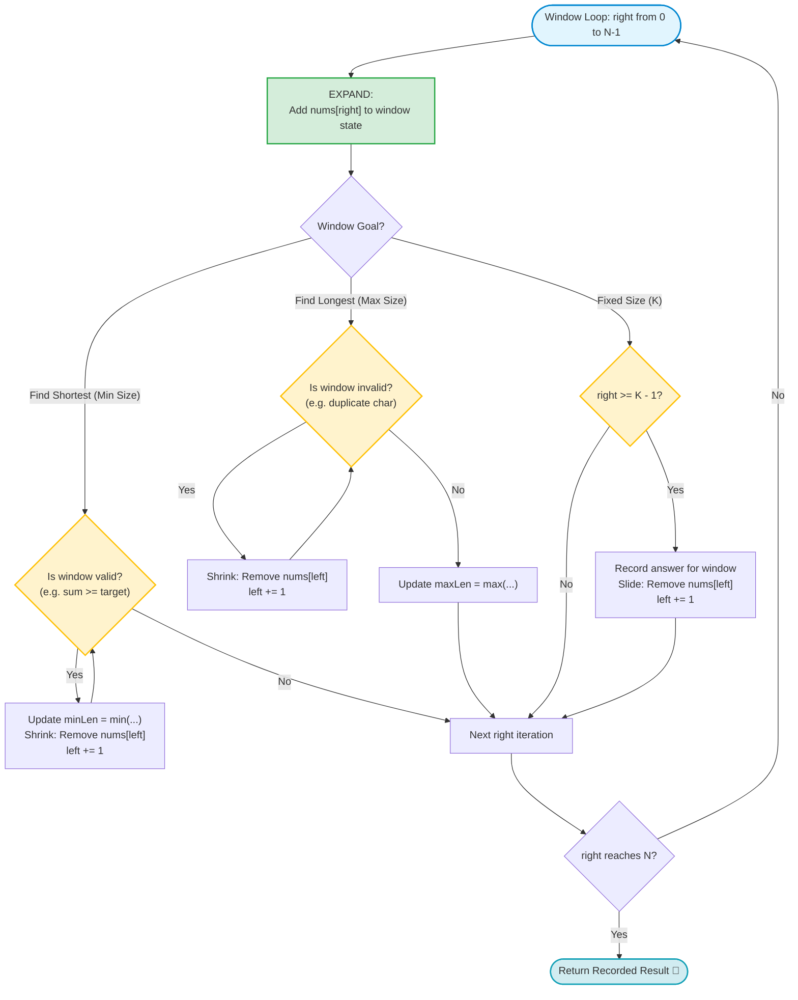

# Pattern 3: Sliding Window (Fixed & Dynamic Subarrays)

> **Difficulty Level:** Beginner to Intermediate  
> **Primary Data Structures:** Arrays, Strings  
> **Time Complexity:** $O(N)$ (Each element enters and leaves the window at most once)  
> **Space Complexity:** $O(1)$ to $O(K)$ auxiliary space (e.g., character frequency dictionary)  

---

## 1. Real-World Analogies (Explain Like I'm 5 👶)

### Analogy A: The Caterpillar 🐛
> Imagine a caterpillar moving across a branch.  
> To move forward, it first stretches its head forward (**Expands Right**).  
> Then it scrunches its tail forward (**Shrinks Left**).  
> The caterpillar never lifts its entire body off the branch at once — it glides forward continuously without starting from scratch!

### Analogy B: The Camera Zoom Frame 📷
> Imagine viewing a panoramic photo through an adjustable picture frame.  
> You widen the right side of the frame to capture more objects.  
> If the scene inside the frame gets too crowded or violates a rule, you slide the left side inward to re-focus.  
> Instead of examining all $N^2$ possible frame crops one-by-one, you just smoothly slide the frame from left to right!

---

## 2. Core Concepts & Visual Blueprint 🗺️

A **window** is a contiguous range of elements defined by two boundary indices: `left` and `right`.
There are two primary types of sliding windows:

```text
Type 1: Fixed-Size Window (Window Size = K)
  [ 1,   4,   2,   10,   23,   3,   1,   0,   20 ]
    └───────────────┘  (Size is always exactly K = 4)
           └───────────────┘ (Slides 1 step right: add new, drop old)

Type 2: Dynamic / Variable-Size Window
  [ 2,   3,   1,   2,   4,   3 ] Target Sum = 7
    [ L ──────── R ]   (Expands right when sum < 7)
        [ L ──── R ]   (Shrinks left when sum >= 7 to find minimum size)
```

---

## 3. When to Use Checklist 🎯

Look for these key signals in the problem statement:

- [ ] Does the problem require analyzing a **contiguous** subarray or substring?
- [ ] Are you looking for the **maximum / minimum sum or average** of a subarray with a fixed length $K$?
- [ ] Are you looking for the **longest / shortest** subarray or substring that satisfies a condition?
- [ ] Does the problem mention finding a substring containing **at most $K$ distinct characters**?
- [ ] Does the problem ask for the **longest substring without repeating characters**?

### Signal Words:
- *"Contiguous subarray..."*
- *"Subarray of size $k$..."*
- *"Longest substring..."*
- *"Minimum window containing..."*

---

## 4. The Expand & Shrink Decision Rules & Flowchart 🧠



| Window Type | Goal | When to Shrink (`left += 1`) | What to Record |
| :--- | :--- | :--- | :--- |
| **Variable (Find Shortest)** | Shortest subarray meeting condition (e.g., Sum $\ge T$) | **While** the window condition is **satisfied** (try to make it even smaller). | `minLen = min(minLen, right - left + 1)` |
| **Variable (Find Longest)** | Longest valid substring (e.g., No repeating characters) | **While** the window condition is **violated** (shrink until valid again). | `maxLen = max(maxLen, right - left + 1)` |
| **Fixed (Size $K$)** | Best metric of exactly $K$ items | When `right >= k - 1`, subtract `nums[left]` and advance `left += 1`. | Update metric after window reaches size $K$. |

---

## 5. Step-by-Step ASCII Walkthrough 🚶‍♂️

### Walkthrough: Minimum Size Subarray Sum (LeetCode #209)
**Problem:** Find the minimal length of a contiguous subarray of which the sum $\ge 7$.  
**Input:** `nums = [2, 3, 1, 2, 4, 3]`, `target = 7`

```text
================================================================================
Initial Setup: left = 0, currentSum = 0, minLength = ∞
================================================================================

Step 1: right = 0, add nums[0] (2)
 [ 2,  3,  1,  2,  4,  3 ]
   L/R
 currentSum = 2 (< 7) ──▶ Keep expanding.

Step 2: right = 1, add nums[1] (3)
 [ 2,  3,  1,  2,  4,  3 ]
   L   R
 currentSum = 2 + 3 = 5 (< 7) ──▶ Keep expanding.

Step 3: right = 2, add nums[2] (1)
 [ 2,  3,  1,  2,  4,  3 ]
   L       R
 currentSum = 5 + 1 = 6 (< 7) ──▶ Keep expanding.

Step 4: right = 3, add nums[3] (2)
 [ 2,  3,  1,  2,  4,  3 ]
   L           R
 currentSum = 6 + 2 = 8 (>= 7 ✅ Window is valid!)
 - Window length = 3 - 0 + 1 = 4. minLength = 4.
 - Shrink from left: subtract nums[0] (2), left becomes 1.
 - currentSum = 6 (< 7) ──▶ Stop shrinking.

Step 5: right = 4, add nums[4] (4)
 [ 2,  3,  1,  2,  4,  3 ]
       L           R
 currentSum = 6 + 4 = 10 (>= 7 ✅ Valid!)
 - Window length = 4 - 1 + 1 = 4. minLength = 4.
 - Shrink: subtract nums[1] (3), left becomes 2. currentSum = 7 (>= 7 ✅ Still valid!).
 - Window length = 4 - 2 + 1 = 3. minLength = min(4, 3) = 3.
 - Shrink: subtract nums[2] (1), left becomes 3. currentSum = 6 (< 7) ──▶ Stop shrinking.

Step 6: right = 5, add nums[5] (3)
 [ 2,  3,  1,  2,  4,  3 ]
               L       R
 currentSum = 6 + 3 = 9 (>= 7 ✅ Valid!)
 - Window length = 5 - 3 + 1 = 3. minLength = 3.
 - Shrink: subtract nums[3] (2), left becomes 4. currentSum = 7 (>= 7 ✅ Still valid!).
 - Window length = 5 - 4 + 1 = 2. minLength = min(3, 2) = 2! 🎉 [Subarray is [4, 3]]
 - Shrink: subtract nums[4] (4), left becomes 5. currentSum = 3 (< 7) ──▶ Stop shrinking.

End of array reached.
Final Answer: minLength = 2 (The contiguous subarray [4, 3] sums to 7).
================================================================================
```

---

## 6. Idiomatic Swift Code Implementations 💻

### Program 1: Minimum Size Subarray Sum — LeetCode #209 (Dynamic Window)

```swift
func minSubArrayLen(_ target: Int, _ nums: [Int]) -> Int {
    var left = 0
    var currentSum = 0
    var minLength = Int.max
    
    for right in 0..<nums.count {
        // 1. EXPAND: Include new element at right
        currentSum += nums[right]
        
        // 2. SHRINK: While target condition is met, try to minimize the window
        while currentSum >= target {
            let currentWindowSize = right - left + 1
            minLength = min(minLength, currentWindowSize)
            
            // Remove left-most element and advance left pointer
            currentSum -= nums[left]
            left += 1
        }
    }
    
    return minLength == Int.max ? 0 : minLength
}

// Verification
print(minSubArrayLen(7, [2, 3, 1, 2, 4, 3])) // Output: 2 (Subarray [4, 3])
```

---

### Program 2: Maximum Average Subarray I — LeetCode #643 (Fixed-Size Window)

```swift
func findMaxAverage(_ nums: [Int], _ k: Int) -> Double {
    // Calculate initial sum of the first k elements
    var currentSum = nums[0..<k].reduce(0, +)
    var maxSum = currentSum
    
    // Slide the window of size k across the rest of the array
    for right in k..<nums.count {
        // Add new element on right, discard element that falls off on left
        currentSum += nums[right] - nums[right - k]
        maxSum = max(maxSum, currentSum)
    }
    
    return Double(maxSum) / Double(k)
}

// Verification
let numsAvg = [1, 12, -5, -6, 50, 3]
print(findMaxAverage(numsAvg, 4)) // Output: 12.75 (Subarray [12, -5, -6, 50])
```

---

### Program 3: Longest Substring Without Repeating Characters — LeetCode #3

```swift
func lengthOfLongestSubstring(_ s: String) -> Int {
    var charLastSeen = [Character: Int]() // Hash table tracking last seen index
    var left = 0
    var maxLength = 0
    let chars = Array(s)
    
    for right in 0..<chars.count {
        let currentChar = chars[right]
        
        // If character was seen and lies inside current window, jump left pointer
        if let lastIndex = charLastSeen[currentChar], lastIndex >= left {
            left = lastIndex + 1
        }
        
        // Record latest position of character
        charLastSeen[currentChar] = right
        
        // Window length is right - left + 1
        maxLength = max(maxLength, right - left + 1)
    }
    
    return maxLength
}

// Verification
print(lengthOfLongestSubstring("abcabcbb")) // Output: 3 ("abc")
print(lengthOfLongestSubstring("bbbbb"))    // Output: 1 ("b")
print(lengthOfLongestSubstring("pwwkew"))   // Output: 3 ("wke")
```

---

## 7. Complexity Analysis ⏱️

- **Time Complexity:** $O(N)$
  - Even though there is an inner `while` loop, notice that `left` only moves forward and never resets. Each element is added by `right` once and removed by `left` at most once. Hence, total operations are at most $2N$, which simplifies to $O(N)$.
- **Space Complexity:**
  - $O(1)$ auxiliary space for numeric subarray problems (stores only scalar sum and indices).
  - $O(\min(N, \Sigma))$ auxiliary space for string problems using a hash table where $\Sigma$ is the alphabet size (e.g. 26 lowercase English letters or 128 ASCII characters).

---

## 8. Common Traps & Edge Cases ⚠️

> [!WARNING]
> 1. **Contiguous Requirement:**  
>    The Sliding Window technique **only** applies to contiguous subarrays or substrings. If non-contiguous subsequences are allowed, this pattern does not apply (consider Dynamic Programming or Greedy instead).
>
> 2. **Negative Numbers in Sum Windows:**  
>    Notice that in `minSubArrayLen`, the assumption is that all numbers are positive, guaranteeing that adding an element increases the sum and removing an element decreases it. If the array has negative numbers, the monotonic property breaks; use a **Prefix Sum + Monotonic Deque** instead.
>
> 3. **Window Size Formula:**  
>    Remember that window length inclusive of both endpoints is always `right - left + 1`, NOT `right - left`.

---

## 9. LeetCode Practice Matrix 🎯

| Difficulty | LeetCode # | Problem Name | Window Type | Status |
| :--- | :--- | :--- | :--- | :---: |
| 🟢 Easy | [#643](https://leetcode.com/problems/maximum-average-subarray-i/) | Maximum Average Subarray I | Fixed ($k$) | [ ] |
| 🟡 Medium | [#209](https://leetcode.com/problems/minimum-size-subarray-sum/) | Minimum Size Subarray Sum | Dynamic (Minimize) | [ ] |
| 🟡 Medium | [#3](https://leetcode.com/problems/longest-substring-without-repeating-characters/) | Longest Substring Without Repeating Characters | Dynamic (Maximize) | [ ] |
| 🟡 Medium | [#424](https://leetcode.com/problems/longest-repeating-character-replacement/) | Longest Repeating Character Replacement | Dynamic + Frequency | [ ] |
| 🟡 Medium | [#567](https://leetcode.com/problems/permutation-in-string/) | Permutation in String | Fixed ($k = s1.length$) | [ ] |
| 🟡 Medium | [#1004](https://leetcode.com/problems/max-consecutive-ones-iii/) | Max Consecutive Ones III | Dynamic (At most $k$ zeroes) | [ ] |
| 🔴 Hard | [#76](https://leetcode.com/problems/minimum-window-substring/) | Minimum Window Substring | Dynamic + Two Hash Maps | [ ] |

---

## 10. Connection to Our Swift Playgrounds 💡

In our [Sets.playground](file:///Users/akshatgandhi/Projects/Demo/MyLearnings/Algorithms/Swift%20Collection/Sets.playground), we explored how Swift sets and dictionaries achieve $O(1)$ average time lookups using hash tables. 

In `lengthOfLongestSubstring`, we use a Swift Dictionary `[Character: Int]` to jump `left` forward in $O(1)$ time rather than incrementing `left` one step at a time, making string sliding windows hyper-efficient in Swift!
