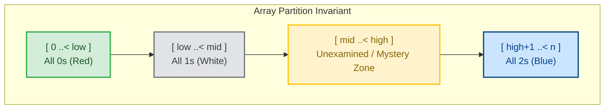
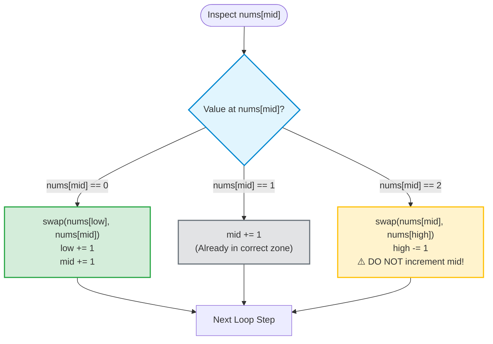

# Pattern 4: Dutch National Flag (3 Pointers / 3-Way Partitioning)

> **Difficulty Level:** Intermediate  
> **Primary Data Structures:** Arrays  
> **Time Complexity:** $O(N)$ (Strictly single pass)  
> **Space Complexity:** $O(1)$ (In-place swaps)  

---

## 1. Real-World Analogy (Explain Like I'm 5 👶)

> **The Three-Color Bead Sorting Station:**  
> Imagine a conveyor belt carrying mixed **Red**, **White**, and **Blue** beads.  
> You have three baskets:
> - Left Basket: Red beads (value `0`)
> - Middle Basket: White beads (value `1`)
> - Right Basket: Blue beads (value `2`)
>
> You use three fingers:
> - `low`: The boundary where the next Red bead belongs.
> - `high`: The boundary where the next Blue bead belongs.
> - `mid`: The inspector finger scanning the mystery beads in the middle.
>
> When `mid` sees a Red bead, it tosses it to `low`. When it sees a Blue bead, it tosses it to `high`. When it sees a White bead, it leaves it right where it is and moves on!

---

## 2. Core Concept & Visual Blueprint 🗺️

The algorithm maintains **4 distinct zones** in the array simultaneously during the single pass:



### Initial State:
- `low = 0` (boundary of 0s)
- `mid = 0` (current scanner)
- `high = nums.count - 1` (boundary of 2s)

The loop runs **while `mid <= high`**. When `mid > high`, the unexamined zone disappears and the entire array is sorted!

---

## 3. When to Use Checklist 🎯

- [ ] Does the problem require sorting an array containing only **3 distinct values** (e.g., `[0, 1, 2]`) in $O(N)$ time?
- [ ] Does the problem ask to partition an array around a **pivot element** into elements *less than*, *equal to*, and *greater than* the pivot (3-Way Quicksort)?
- [ ] Are you asked to group elements in-place with $O(1)$ memory without using language sorting libraries?

### Signal Words:
- *"Sort colors in-place..."*
- *"Partition array into three parts..."*
- *"Dutch National Flag problem..."*

---

## 4. The Decision Rule Flowchart 🧠



| Value at `nums[mid]` | Action | Why? |
| :--- | :--- | :--- |
| `0` (belongs in low zone) | `nums.swapAt(low, mid)`<br>`low += 1`<br>`mid += 1` | The value swapped into `low` was guaranteed to be `1` (or `mid == low`), so both pointers advance safely. |
| `1` (belongs in mid zone) | `mid += 1` | `1` is already in its correct middle partition. Just move scanner forward. |
| `2` (belongs in high zone) | `nums.swapAt(mid, high)`<br>`high -= 1` | **Do NOT advance `mid`!** The element swapped from `high` into `mid` is unexamined (could be `0`, `1`, or `2`) and must be inspected on the next step. |

---

## 5. Step-by-Step ASCII Walkthrough 🚶‍♂️

**Problem:** Sort colors `[2, 0, 2, 1, 1, 0]` in-place.

```text
================================================================================
Initial Setup: low = 0, mid = 0, high = 5
================================================================================

Step 1: nums[mid] == nums[0] == 2
Action: swap(nums[mid], nums[high]) -> swap(nums[0], nums[5]), high -= 1 (high = 4).
 [ 0,  0,  2,  1,  1,  2 ]
   L/M                 H
 (Notice: mid stays 0 to evaluate the swapped value!)

Step 2: nums[mid] == nums[0] == 0
Action: swap(nums[low], nums[mid]) -> swap(0, 0), low += 1 (1), mid += 1 (1).
 [ 0,  0,  2,  1,  1,  2 ]
       L/M             H

Step 3: nums[mid] == nums[1] == 0
Action: swap(nums[low], nums[mid]) -> swap(1, 1), low += 1 (2), mid += 1 (2).
 [ 0,  0,  2,  1,  1,  2 ]
           L/M         H

Step 4: nums[mid] == nums[2] == 2
Action: swap(nums[mid], nums[high]) -> swap(nums[2], nums[4]), high -= 1 (high = 3).
 [ 0,  0,  1,  1,  2,  2 ]
           L   M   H
 (mid stays 2 to inspect new element)

Step 5: nums[mid] == nums[2] == 1
Action: mid += 1 (mid = 3).
 [ 0,  0,  1,  1,  2,  2 ]
           L       M/H

Step 6: nums[mid] == nums[3] == 1
Action: mid += 1 (mid = 4).
 [ 0,  0,  1,  1,  2,  2 ]
           L   H   M
 Loop condition (mid <= high) is now FALSE (4 <= 3 is false). Loop terminates.

Final Sorted Array: [0, 0, 1, 1, 2, 2] ✅
================================================================================
```

---

## 6. Idiomatic Swift Code Implementations 💻

### Program 1: Sort Colors — LeetCode #75

```swift
func sortColors(_ nums: inout [Int]) {
    guard nums.count > 1 else { return }
    
    var low = 0
    var mid = 0
    var high = nums.count - 1
    
    while mid <= high {
        switch nums[mid] {
        case 0:
            // Swap 0 to the low boundary
            nums.swapAt(low, mid)
            low += 1
            mid += 1
            
        case 1:
            // 1 is in correct middle position, advance scanner
            mid += 1
            
        case 2:
            // Swap 2 to the high boundary
            nums.swapAt(mid, high)
            high -= 1
            // CRITICAL: Do NOT increment mid here!
            // The item swapped from 'high' into 'mid' has not been inspected yet.
            
        default:
            break
        }
    }
}

// Verification
var colors = [2, 0, 2, 1, 1, 0]
sortColors(&colors)
print("Sorted colors: \(colors)") // Output: [0, 0, 1, 1, 2, 2]
```

---

### Program 2: Sort Array By Parity (Two-Way Partitioning Variant) — LeetCode #905

```swift
func sortArrayByParity(_ nums: [Int]) -> [Int] {
    var arr = nums
    var low = 0
    var high = arr.count - 1
    
    while low < high {
        if arr[low] % 2 > arr[high] % 2 {
            arr.swapAt(low, high)
        }
        if arr[low] % 2 == 0 { low += 1 }
        if arr[high] % 2 == 1 { high -= 1 }
    }
    
    return arr
}

// Verification
print(sortArrayByParity([3, 1, 2, 4])) // Output: [4, 2, 1, 3] (Evens first, odds last)
```

---

## 7. Complexity Analysis ⏱️

- **Time Complexity:** $O(N)$
  - On every iteration, either `mid` increases by 1 or `high` decreases by 1. Since `mid` and `high` start at opposite ends and move toward each other, the loop executes at most $N$ times.
- **Space Complexity:** $O(1)$
  - Sorting is performed strictly in-place using `nums.swapAt()`. No additional arrays or collections are allocated.

---

## 8. Common Traps & Edge Cases ⚠️

> [!CAUTION]
> 1. **Advancing `mid` after `high` swap:**  
>    This is the #1 bug candidates write in interviews! When you swap `nums[mid]` with `nums[high]`, the element that arrived at `mid` was previously at `high` and has **never been checked**. If you advance `mid += 1`, you will skip inspecting that element, resulting in an unsorted array.
>
> 2. **Loop Condition (`mid <= high` vs `mid < high`):**  
>    You must use `mid <= high`. When `mid == high`, that final element at index `mid` still resides in the unexamined zone and must be evaluated.

---

## 9. LeetCode Practice Matrix 🎯

| Difficulty | LeetCode # | Problem Name | Partition Type | Status |
| :--- | :--- | :--- | :--- | :---: |
| 🟡 Medium | [#75](https://leetcode.com/problems/sort-colors/) | Sort Colors | 3-Way Partitioning (0, 1, 2) | [ ] |
| 🟢 Easy | [#905](https://leetcode.com/problems/sort-array-by-parity/) | Sort Array By Parity | 2-Way Partitioning (Even/Odd) | [ ] |
| 🟢 Easy | [#922](https://leetcode.com/problems/sort-array-by-parity-ii/) | Sort Array By Parity II | Parity Indexed Partitioning | [ ] |
| 🟡 Medium | [#280](https://leetcode.com/problems/wiggle-sort/) | Wiggle Sort | Local Invariant Partitioning | [ ] |
| 🟡 Medium | [#324](https://leetcode.com/problems/wiggle-sort-ii/) | Wiggle Sort II | 3-Way Virtual Index Partitioning | [ ] |

---

## 10. Connection to Our Swift Playgrounds 💡

In our [Arrays.playground](file:///Users/akshatgandhi/Projects/Demo/MyLearnings/Algorithms/Swift%20Collection/Arrays.playground), we highlighted that modifying arrays in-place via pointer indices avoids memory reallocation. 

Using Swift's built-in `nums.swapAt(i, j)`:
- Executes in $O(1)$ time with zero heap allocations.
- Operates directly on the underlying contiguous memory buffer of the array, preventing Swift from triggering Copy-on-Write (CoW).
