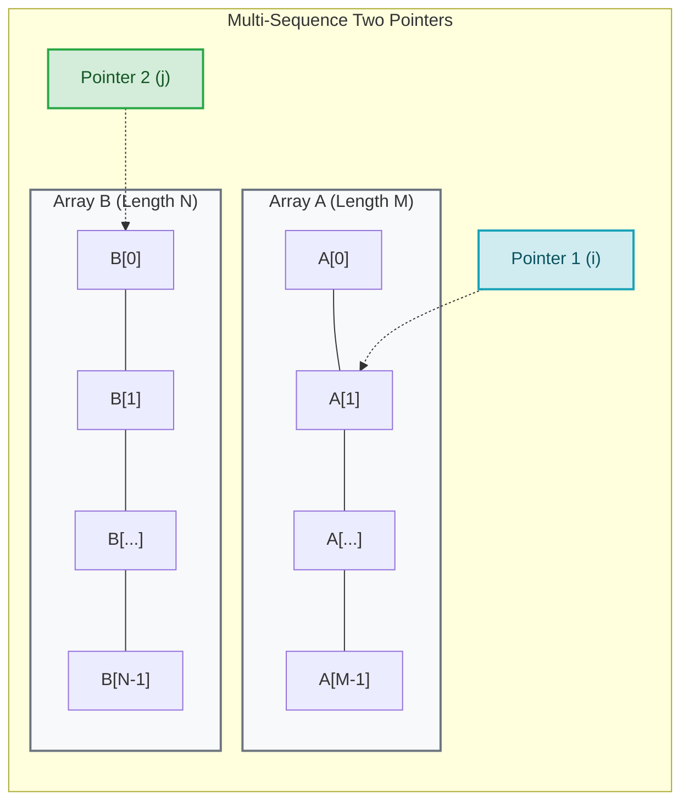
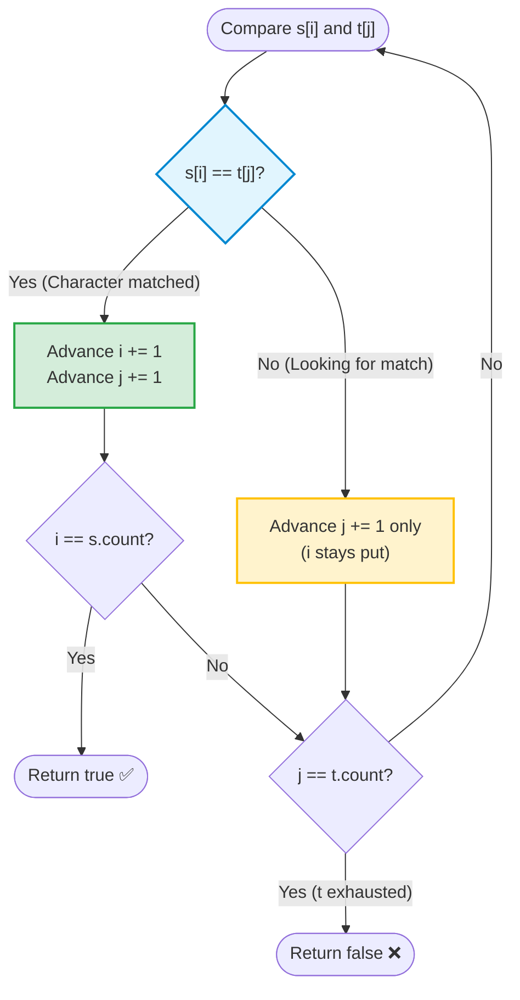
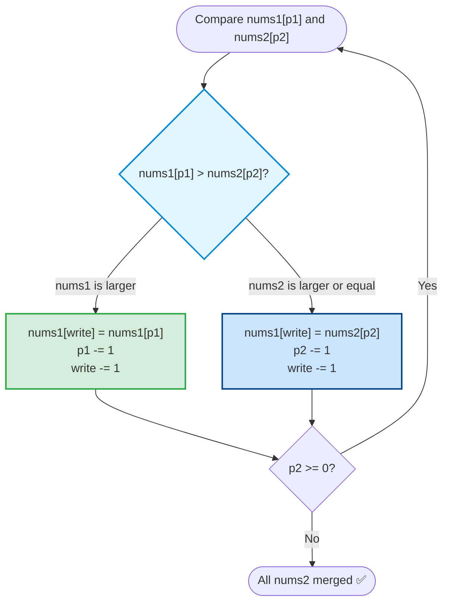

# Pattern 5: Two Pointers Across Two Arrays (Two Sequences & Merging)

> **Difficulty Level:** Beginner to Intermediate  
> **Primary Data Structures:** Arrays, Strings, Linked Lists  
> **Time Complexity:** $O(M + N)$ (Linear traversal of both collections)  
> **Space Complexity:** $O(1)$ auxiliary space  

---

## 1. Real-World Analogy (Explain Like I'm 5 👶)

> **The Two Supermarket Queues Analogy:**  
> Imagine two lines of shoppers waiting at two adjacent registers (Queue A and Queue B).  
> A cashier wants to combine them into one single order line sorted by arrival time.  
> The cashier looks at the person at the front of Queue A (**Pointer 1**) and the person at the front of Queue B (**Pointer 2**).  
> Whichever person arrived earlier steps into the unified line, and only that queue advances forward!  
> The cashier repeats this until everyone has merged into order.

---

## 2. Core Concept & Visual Blueprint 🗺️

Instead of moving two pointers within the *same* array, we initialize **one pointer per collection**:
- `p1` tracks the current position in `Array A`
- `p2` tracks the current position in `Array B`



### Two Direction Strategies:
1. **Forward Traversal (Subsequence Matching / Comparison):** Both pointers start at index `0` and move forward.
2. **Backward Traversal (In-Place Merging):** When merging `nums2` into `nums1` without allocating extra memory, pointers start at the **back** to prevent overwriting unmerged values!

---

## 3. When to Use Checklist 🎯

- [ ] Are you given **two separate sorted arrays** and asked to merge them?
- [ ] Do you need to check if string $S$ is a **subsequence** of string $T$?
- [ ] Are you finding the **intersection or common elements** between two sorted lists?
- [ ] Are you comparing intervals from two sorted schedules (e.g., Interval List Intersections)?

### Signal Words:
- *"Merge two sorted arrays in-place..."*
- *"Given two strings s and t, return true if s is a subsequence of t..."*
- *"Find the intersection of two arrays..."*

---

## 4. The Decision Rule Flowcharts 🧠

### A. Subsequence Matching Logic


---

### B. Backward In-Place Merge Logic (LeetCode #88)


---

## 5. Step-by-Step ASCII Walkthrough 🚶‍♂️

### Walkthrough: Merge Sorted Array from the Back (LeetCode #88)
**Input:** `nums1 = [1, 2, 3, 0, 0, 0]`, `m = 3`, `nums2 = [2, 5, 6]`, `n = 3`

```text
================================================================================
Initial Setup: p1 = m - 1 = 2 (val: 3), p2 = n - 1 = 2 (val: 6), write = 5
================================================================================

Step 1: Compare nums1[p1] (3) vs nums2[p2] (6)
 - 6 > 3 ──▶ Place 6 at nums1[write]: nums1[5] = 6
 - p2 -= 1 (1), write -= 1 (4)
 nums1: [ 1,  2,  3,  0,  0,  6 ]
                  p1          W
 nums2: [ 2,  5,  6 ]
              p2

Step 2: Compare nums1[p1] (3) vs nums2[p2] (5)
 - 5 > 3 ──▶ Place 5 at nums1[write]: nums1[4] = 5
 - p2 -= 1 (0), write -= 1 (3)
 nums1: [ 1,  2,  3,  0,  5,  6 ]
                  p1      W
 nums2: [ 2,  5,  6 ]
          p2

Step 3: Compare nums1[p1] (3) vs nums2[p2] (2)
 - 3 > 2 ──▶ Place 3 at nums1[write]: nums1[3] = 3
 - p1 -= 1 (1), write -= 1 (2)
 nums1: [ 1,  2,  3,  3,  5,  6 ]
              p1  W
 nums2: [ 2,  5,  6 ]
          p2

Step 4: Compare nums1[p1] (2) vs nums2[p2] (2)
 - Equal ──▶ Place nums2[p2]: nums1[2] = 2
 - p2 -= 1 (-1), write -= 1 (1)
 nums1: [ 1,  2,  2,  3,  5,  6 ]
              p1
 nums2: [ 2,  5,  6 ]
      p2

p2 is now -1 (all elements of nums2 placed!).
Remaining elements of nums1 are already in their sorted places!

Final Merged Array: [1, 2, 2, 3, 5, 6] ✅
================================================================================
```

---

## 6. Idiomatic Swift Code Implementations 💻

### Program 1: Merge Sorted Array In-Place — LeetCode #88

```swift
func merge(_ nums1: inout [Int], _ m: Int, _ nums2: [Int], _ n: Int) {
    var p1 = m - 1       // Last valid element in nums1
    var p2 = n - 1       // Last element in nums2
    var write = m + n - 1 // Last available slot at the back of nums1
    
    // Merge from the back while both arrays have elements remaining
    while p1 >= 0 && p2 >= 0 {
        if nums1[p1] > nums2[p2] {
            nums1[write] = nums1[p1]
            p1 -= 1
        } else {
            nums1[write] = nums2[p2]
            p2 -= 1
        }
        write -= 1
    }
    
    // If nums2 still has leftover elements, copy them in
    // (If nums1 has leftovers, they are already in correct positions!)
    while p2 >= 0 {
        nums1[write] = nums2[p2]
        p2 -= 1
        write -= 1
    }
}

// Verification
var n1 = [1, 2, 3, 0, 0, 0]
let n2 = [2, 5, 6]
merge(&n1, 3, n2, 3)
print("Merged Array: \(n1)") // Output: [1, 2, 2, 3, 5, 6]
```

---

### Program 2: Is Subsequence — LeetCode #392

```swift
func isSubsequence(_ s: String, _ t: String) -> Bool {
    let sChars = Array(s)
    let tChars = Array(t)
    
    var sIndex = 0
    var tIndex = 0
    
    // Traverse both character arrays
    while sIndex < sChars.count && tIndex < tChars.count {
        if sChars[sIndex] == tChars[tIndex] {
            sIndex += 1 // Matched character in s, search for next
        }
        tIndex += 1 // Always move through t
    }
    
    // If sIndex reached the end of s, all characters were found in order!
    return sIndex == sChars.count
}

// Verification
print(isSubsequence("abc", "ahbgdc")) // Output: true
print(isSubsequence("axc", "ahbgdc")) // Output: false
```

---

## 7. Complexity Analysis ⏱️

- **Time Complexity:** $O(M + N)$
  - Each pointer traverses its respective array from start to end (or end to start) at most once. No nested re-scans occur.
- **Space Complexity:** $O(1)$
  - In-place merging writes directly into the pre-allocated trailing capacity of `nums1`. Zero extra heap buffer is allocated.

---

## 8. Common Traps & Edge Cases ⚠️

> [!WARNING]
> 1. **Leftover Elements in Array 2:**  
>    In `merge`, after the main `while p1 >= 0 && p2 >= 0` loop finishes, you **must** copy any remaining elements from `nums2` using `while p2 >= 0`. (You do not need to do this for `nums1` because they are already sitting in their correct starting indices).
>
> 2. **Merging From Front vs Back:**  
>    Attempting to merge into `nums1` starting from index `0` will overwrite elements in `nums1` before you have had a chance to compare them. **Always merge from the back** when destination array has trailing buffer space.

---

## 9. LeetCode Practice Matrix 🎯

| Difficulty | LeetCode # | Problem Name | Two-Array Strategy | Status |
| :--- | :--- | :--- | :--- | :---: |
| 🟢 Easy | [#88](https://leetcode.com/problems/merge-sorted-array/) | Merge Sorted Array | Backward In-Place Merge | [ ] |
| 🟢 Easy | [#392](https://leetcode.com/problems/is-subsequence/) | Is Subsequence | Forward Two-Pointer Scan | [ ] |
| 🟢 Easy | [#349](https://leetcode.com/problems/intersection-of-two-arrays/) | Intersection of Two Arrays | Two-Pointer / Hash Set | [ ] |
| 🟡 Medium | [#986](https://leetcode.com/problems/interval-list-intersections/) | Interval List Intersections | Advance pointer with smaller endpoint | [ ] |
| 🟡 Medium | [#244](https://leetcode.com/problems/shortest-word-distance-ii/) | Shortest Word Distance II | Compare two sorted index lists | [ ] |

---

## 10. Connection to Our Swift Playgrounds 💡

In our [Arrays.playground](file:///Users/akshatgandhi/Projects/Demo/MyLearnings/Algorithms/Swift%20Collection/Arrays.playground), we proved that `removeFirst()` forces an $O(N)$ shift of all following elements. 

Merging from the back in LeetCode #88 leverages the opposite principle: writing into the trailing uninitialized capacity of an array is an $O(1)$ write operation that causes **zero memory shifts**!
